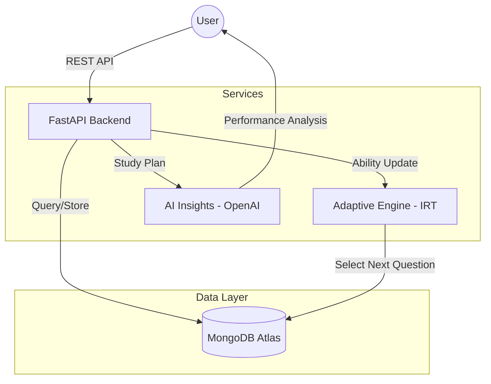

# AI-Driven Adaptive Diagnostic Engine

A production-grade backend for an intelligent adaptive testing system. This engine leverages **Item Response Theory (IRT)** to dynamically adjust difficulty and **OpenAI GPT-4** to provide personalized study insights based on student performance.

---

## 🏗️ Project Overview

The **AI-Driven Adaptive Diagnostic Engine** is designed to provide a tailored testing experience. Unlike linear tests, this engine estimates a student's latent ability in real-time and selects questions that offer the maximum information gain. Upon completion, it generates a structured 3-step study plan to address identified knowledge gaps.

---

## 🧩 Architecture Diagram

---

## 📊 MongoDB Schema

The system uses two primary collections with strict JSON schema validation:

### 1. `questions`

| Field            | Type          | Description                            |
| :--------------- | :------------ | :------------------------------------- |
| `question`       | String        | The content of the question.           |
| `options`        | Array[String] | 4 multiple-choice options.             |
| `correct_answer` | String        | The exact value of the correct option. |
| `difficulty`     | Double        | IRT difficulty parameter (0.1 to 1.0). |
| `topic`          | String        | Subject category (e.g., Algebra).      |

### 2. `user_sessions`

| Field                | Type          | Description                              |
| :------------------- | :------------ | :--------------------------------------- |
| `user_id`            | String        | Unique identifier for the student.       |
| `ability_score`      | Double        | Current IRT ability estimate ($\theta$). |
| `correct_count`      | Integer       | Total correct answers in session.        |
| `answered_questions` | Array[ID]     | List of question ObjectIDs answered.     |
| `topics_missed`      | Array[String] | Unique topics where user failed.         |

---

## 🧠 Adaptive Algorithm Explanation (IRT)

The engine implements a **1-Parameter Logistic (1PL) Model** from Item Response Theory.

### Probability of Correct Response ($P$):

$$P(\text{correct}) = \frac{1}{1 + e^{-(\theta - \beta)}}$$

- **$\theta$ (Theta)**: User's estimated ability score.
- **$\beta$ (Beta)**: Item difficulty level.

### Ability Update Rule:

The score is updated after every response using a learning rate ($\alpha$):
$$\theta_{new} = \theta_{old} + \alpha \times (\text{result} - P)$$

- **Result**: 1.0 if correct, 0.0 if incorrect.
- **Clamping**: Ability is always maintained within the range $[0.1, 1.0]$.

---

## 🚀 API Endpoints

| Method | Endpoint                  | Description                                   |
| :----- | :------------------------ | :-------------------------------------------- |
| `POST` | `/start-session`          | Initialize a test session ($\theta = 0.5$).   |
| `GET`  | `/next-question/{id}`     | Return question closest to current $\theta$.  |
| `POST` | `/submit-answer`          | Submit response, update $\theta$, and counts. |
| `GET`  | `/questions/`             | List all available questions.                 |
| `GET`  | `/sessions/{id}/insights` | Generate AI-powered 3-step study plan.        |

---

## ⚙️ Running the Project

1. **Install Dependencies**: `pip install -r requirements.txt`
2. **Environment**: Set `OPENAI_API_KEY` and `MONGODB_URL` in `.env`.
3. **Database Setup**:
   - Run `python scripts/setup_db_schemas.py` to initialize validation rules.
   - Run `python seed/seed_questions.py` to populate GRE dataset.
4. **Start Server**: `uvicorn app.main:app --reload`

---

## 🛠️ AI Tools Used

- **Antigravity (Google DeepMind)**: Core architect for code generation, schema design, and documentation.
- **OpenAI GPT-4**: Backend intelligence for study plan generation and performance analysis.
- **Mermaid.js**: For architectural visualization within documentation.

---

## 📝 AI Log

The development of this project was significantly accelerated using **Antigravity**. The transition from a blank canvas to a production-ready backend took less than 20 minutes of active agent collaboration.

- **Phase 1 (Architecture)**: Antigravity scaffolded the modular folder structure and implemented the Pydantic-MongoDB integration.
- **Phase 2 (Logic)**: The IRT logistic model was precisely implemented and verified via automated script generation.
- **Phase 3 (Optimization)**: Antigravity autonomously refactored the database layer to use formal JSON Schema validation via `pymongo`, ensuring data integrity beyond application logic.
- **Phase 4 (Content)**: The 20-question GRE dataset was generated with varied difficulty distributions to test the adaptive engine's responsiveness.
